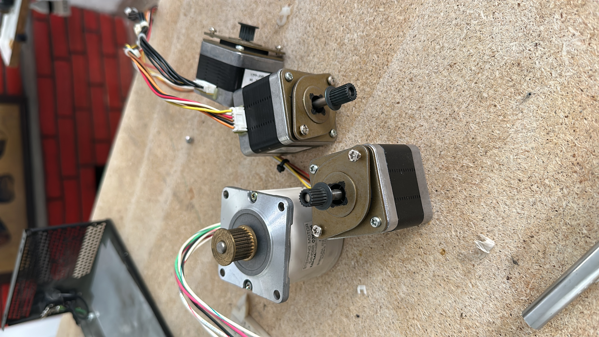
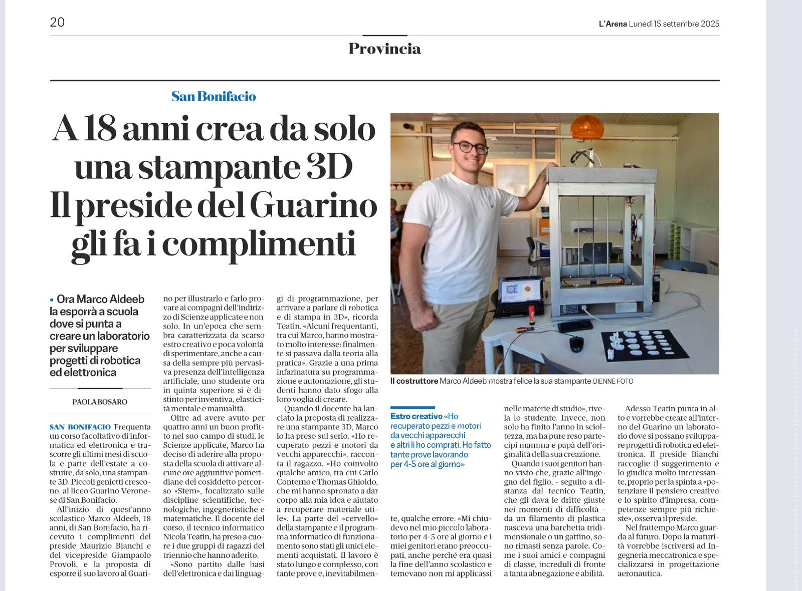

# Hi there, I'm Marco 👋

**Mechatronics Engineering Student @ UniPD | Maker & Hardware Developer**

I specialize in hardware prototyping, embedded systems, motion control, and upcycling decommissioned electronics into functional automation projects.

---

### 🛠️ Tech Stack & Skills

- **Hardware & Prototyping:** Microcontrollers (Arduino, ESP32), Raspberry Pi, PIR & Motion Sensors, 3D Printing (RepRap), Soldering & Wiring
- **Software & Programming:** C/C++, Python, Linux (Arch/Ubuntu), Git, Docker, Flask
- **Systems & Tools:** Single-Axis Motion Control, CAD/Mechanical Retrofitting, Local LLMs (Ollama)

---

### 🚀 Key Projects

#### 🖨️ Reclaimed RepRap 3D Printer
*Design, assembly, and tuning of an open-source 3D printer built entirely by reclaiming, testing, and upcycling decommissioned electronic and mechanical components.*

- **Hardware Harvesting:** Reused stepper motors, power supply units, and repurposed control boards.
- **Firmware & Tuning:** Custom firmware configuration, axis calibration, thermal tuning, and print parameter optimization.
- **Media Coverage:** Featured in the local newspaper **L'Arena** for sustainable technology and e-waste upcycling.

  
  
  

---

#### 🤖 Interactive Motion-Controlled Mannequin (Fieracavalli Verona)
*Single-axis automation system engineered to animate a display mannequin arm for an artisan booth at the Fieracavalli exhibition.*

- **Sensing & Trigger:** Integrated a PIR motion sensor for automatic movement activation when visitors pass by.
- **Kinematics & Control:** Designed custom single-axis mechanism and programmed microcontroller motion loops.
- **Retrofitting:** Embedded control electronics and actuators seamlessly inside a reclaimed mannequin frame.

  
  

---

### 📂 Full Documentation & Media

- 💼 **LinkedIn Profile:** [www.linkedin.com/in/marco-aldeeb-86b902439](www.linkedin.com/in/marco-aldeeb-86b902439)
